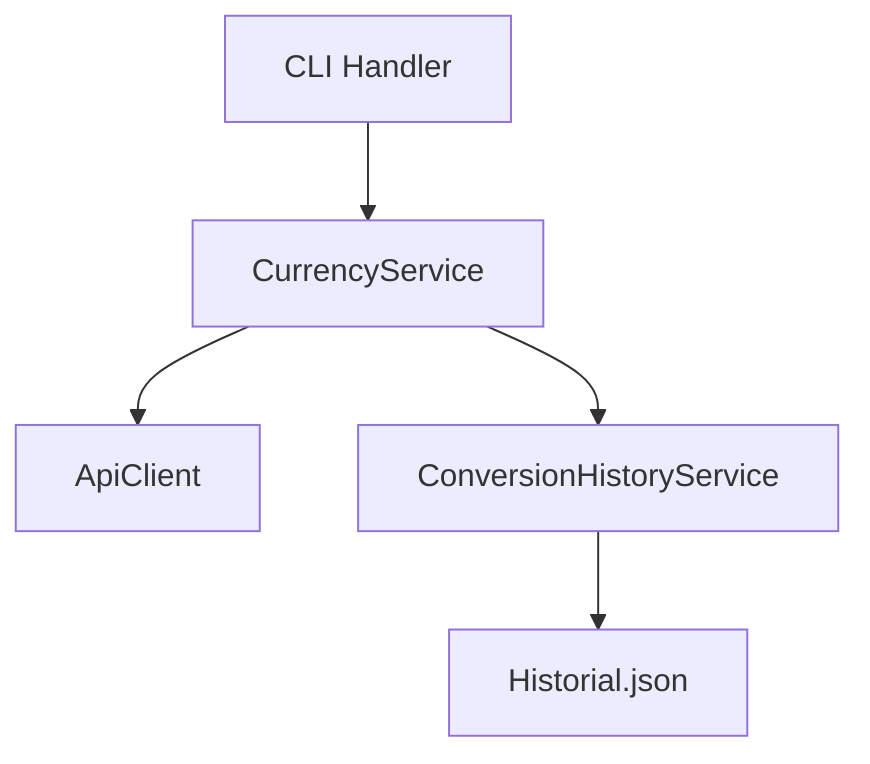
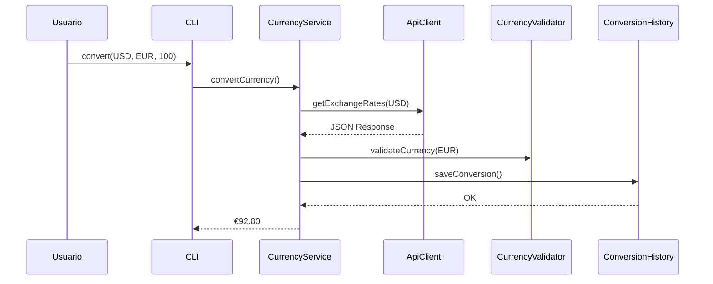

# Conversor de Monedas API

[](https://openjdk.org/)
[](https://maven.apache.org/)

API de conversión de divisas con tasas actualizadas en tiempo real y persistencia de historial.

## 📋 Descripción del Proyecto
Herramienta CLI para conversión monetaria que utiliza tasas de cambio actualizadas mediante API externa. Permite:
- Conversiones en tiempo real
- Historial persistente de transacciones
- Validación de entradas y manejo de errores
- Configuración personalizada de divisas soportadas

## 🎯 Funcionalidades Principales
- ✅ Conversión instantánea con tasas actualizadas
- 📚 Historial de conversiones con persistencia JSON
- 🔒 Validación de divisas soportadas
- ⚙️ Configuración mediante archivo properties
- 📊 Soporte para múltiples formatos de entrada
- 🚦 Manejo de errores con mensajes claros

## 🚀 Comenzando

### Prerrequisitos
- Java 17+
- Maven 3.8+
- Cuenta en [exchangerate-api.com](https://www.exchangerate-api.com)
- Archivo `supportcurrencies.json` configurado (ver estructura en `/data`)
  
### Configuración Inicial
Crear archivo `config.properties` en el directorio `src/main/resources` con:
```properties
api.key=TU_API_KEY_AQUI
api.url=URL_BASE_AQUI
```

### Instalación
```bash
mvn clean install
mvn package
```

## 📦 Arquitectura del Sistema

### Diagrama de Componentes


### Estructura de Directorios
```
currencyexchange/
├── data/                         # Datos persistentes (JSON)
├── src/
│   └── main/
│       ├── java/
│       │   └── com/luiscm/currencyexchange/
│       │       ├── client/       # Cliente API (ApiClient)
│       │       ├── service/      # Lógica de negocio
│       │       ├── model/        # DTOs y entidades
│       │       ├── util/         # Validadores y helpers
│       │       └── view/         # Interfaz CLI
│       └── resources/           # Configuraciones
└── docs/                        # Documentación técnica
```


## 🛠️ Flujo de Trabajo


## 🤝 Contribución
1. Haz fork del proyecto
2. Crea tu branch (`git checkout -b feature/nueva-funcionalidad`)
3. Commit cambios (`git commit -m 'Agrega mejora'`)
4. Push al branch (`git push origin feature/nueva-funcionalidad`)
5. Abre Pull Request

---
⌨️ con ❤️ por LuisCM