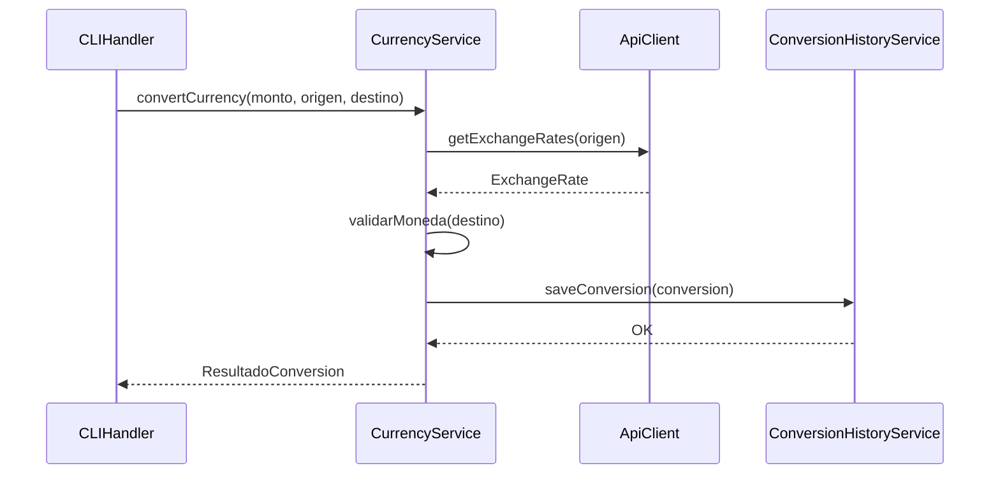

# Lineamientos Arquitectónicos del Proyecto

## Estructura MVC

1. **Modelo**: Clases de dominio (`Conversion`) y DTOs (`ExchangeRate`)
2. **Vista**: Consola (`CLIHandler` - maneja entrada/salida interactiva)
3. **Controlador**: `CurrencyService` (coordina lógica de conversión y acceso a API)

## Capas de la Aplicación

- **Capa Client**: `ApiClient` (comunicación REST con proveedor externo)
- **Capa Service**: `CurrencyService` (lógica de conversión), `ConversionHistoryService` (gestión de historial)
- **Capa Model**: Entidades y DTOs para transferencia de datos
- **Capa Persistencia**: `data/` (almacenamiento en JSON con Gson)

**Interacción entre componentes:**

1. CLIHandler recibe inputs y los envía a CurrencyService
2. CurrencyService valida monedas (usando CurrencyValidator) y obtiene tasas (via ApiClient)
3. ConversionHistoryService persiste resultados en `data/historial.json`

```
currencyexchange/
├── data/                         # Datos persistentes (historial.json, supportcurrencies.json)
└── src/
    └── main/
        └── java/
            └── com/luiscm/currencyexchange/
                ├── client/       # Cliente API (ApiClient)
                ├── exception/    # Excepciones personalizadas
                ├── model/        # Modelos de dominio (Conversion)
                ├── service/      # Servicios (CurrencyService, ConversionHistoryService)
                ├── util/         # Utilidades (ConfigLoader, CurrencyValidator)
                ├── view/         # Interfaz de usuario (CLIHandler)
                └── Main.java     # Punto de entrada principal
```

## Explicación Detallada de la Estructura

### Detalles de Implementación por Capa

1. **Capa Client (client/)**

    ```java
    src/main/java/com/luiscm/currencyexchange/client/ApiClient.java
    public ExchangeRate getExchangeRates(String base) throws Exception {
        HttpRequest request = HttpRequest.newBuilder()
            .uri(URI.create(API_URL + API_KEY + "/latest/" + base))
            .GET()
            .build();

        HttpResponse<String> response = httpClient.send(request, HttpResponse.BodyHandlers.ofString());

        if (response.statusCode() != 200) {
            throw new RuntimeException("Error obteniendo tasas: " + response.body());
        }

        return new Gson().fromJson(response.body(), ExchangeRate.class);
    }
    ```

    - **Patrones**: Builder pattern (HttpRequest.newBuilder()), Singleton para HttpClient
    - **Flujo**: Validación HTTP 200 + parsing JSON con Gson
    - **Configuración**: Inyección de parámetros via config.properties

1. **Capa Service (service/)**

    ```java
    src/main/java/com/luiscm/currencyexchange/service/ConversionHistoryService.java
    public void saveConversion(Conversion conversion) {
        conversions.add(conversion);
        saveToFile();
    }

    private void saveToFile() {
        try (Writer writer = new FileWriter(historyFile)) {
            gson.toJson(conversions, writer);
        } catch (IOException e) {
            e.printStackTrace();
        }
    }
    ```

    - **Patrón**: Observer (notificación automática de persistencia)
    - **Estrategia**: Serialización Gson con TypeToken para listas complejas
    - **Almacenamiento**: Jerarquía de directorios creada con mkdirs()

1. **Flujo Principal (Main.java)**

    ```java
    src/main/java/com/luiscm/currencyexchange/Main.java
    public static void main(String[] args) {
        ApiClient apiClient = new ApiClient();
        CurrencyService currencyService = new CurrencyService(apiClient, new CurrencyValidator());
        try {
            ConversionHistoryService historyService = new ConversionHistoryService();
            new CLIHandler(currencyService, historyService).start();
        } catch (ConfigLoadException e) {
            System.err.println("Error cargando configuración: " + e.getMessage());
            System.exit(1);
        }
    }
    ```

    - **Inyección de Dependencias**: Constructor de CurrencyService
    - **Manejo de Errores**: Catch específico para ConfigLoadException
    - **Inicialización**: Orden de creación de servicios → vista

### Diagrama de Secuencia Principal



### Estrategias Clave

1. **Validación en Dos Niveles**:
   - Capa Servicio: CurrencyValidator con cache LRU
   - Capa Modelo: Anotaciones JSR-380 en DTOs

1. **Manejo de Errores**:
   - Custom Exceptions con contexto específico
   - Fallos no críticos (ej. historial) → loggeo continuo

1. **Persistencia**:
   - Modo Append automático en nuevas conversiones
   - Carga lazy al inicializar servicio

1. **Configuración**:
   - Jerarquía de propiedades (defaults vs custom)
   - Encapsulamiento via ConfigLoader

1. **Capa Client (client/)**
   - `ApiClient.java`: Implementación concreta que maneja las solicitudes HTTP a la API de tasas de cambio usando HttpClient
   - Patrón: Realiza peticiones GET, procesa respuestas JSON con Gson
   - Configuración: Utiliza claves API desde ConfigLoader

1. **Capa Model (model/)**
   - Entidades: `Conversion.java` (registra datos de conversiones)
   - DTOs: `ExchangeRate.java` (mapea respuesta JSON de la API)
   - Responsabilidad: Estructura de datos para transferencia entre capas

1. **Capa Service (service/)**
   - `CurrencyService.java`: Orquesta conversiones, validaciones y acceso a API
   - `ConversionHistoryService.java`: Gestiona persistencia en JSON con Gson
   - Patrones: Inyección de dependencias, Singleton para historial

1. **Capa Vista (view/)**
   - `CLIHandler.java`: Interfaz de línea de comandos con menú interactivo
   - Flujo: Captura inputs, muestra resultados y historial
   - Integración: Comunica con servicios para operaciones

**Componentes Adicionales:**

- `util/`: ConfigLoader (manejo de propiedades) y CurrencyValidator (validación ISO)
- `exception/`: Excepciones personalizadas (ConfigLoadException, InvalidCurrencyException)
- `data/`: Persistencia en historial.json con estructura JSON

## Checklist de funcionalidades principales

1. [x] Consumo de API de tasas de cambio (ApiClient con HttpClient y manejo de errores)
2. [x] Conversión multi-moneda con tasas actualizadas (CurrencyService)
3. [x] Validación ISO 4217 con cache local (CurrencyValidator)
4. [x] Sistema de configuración con properties y JSON (ConfigLoader)
5. [x] Persistencia en historial.json con Gson (ConversionHistoryService)
6. [x] Menú interactivo con flujo completo (CLIHandler)
7. [x] Manejo de errores contextualizados (Custom exceptions)
8. [x] Serialización/deserialización con Gson
9. [x] Función de borrado completo de historial
10. [x] Actualización automática de tasas desde API
11. [x] Validación en múltiples capas (DTOs y servicios)
